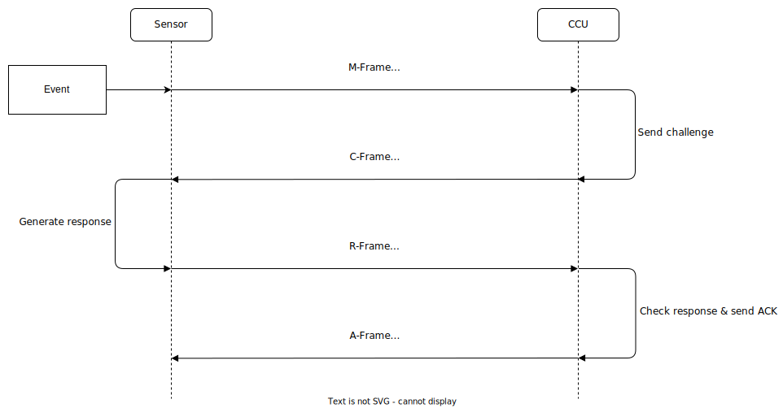

# Disclaimer

As the protocol has not been officially published, all subsequent information in this document should be treated with caution, as they are based on third-party sources and our own research.
Since we strongly support the values of Open Source, we would be very excited if other community members would participate in the improvement of this document.
So don't hesitate and create a pull request if you want to correct, add or delete something.

This documentation is intended to help future smart home systems become even more secure by identifying and analyzing possible attack vectors.
This document is by no means an instruction on how to manipulate Smart Home systems!
We are not responsible for any criminal action!
Also, we are not responsible if you destroy your own equipment by mishandling!
Before conducting any experiments, check that you are legally authorized to do so!

# Glossary

| Acronym      | Description                                    |
| ------------ | ---------------------------------------------- |
| HM           | Homematic                                      |
| BidCos       | Bidirectional Communication Standard           |
| URH          | Universal Radio Hacker                         |
| SDR          | Software Defined Radio                         |
| SHMS         | Smart Home Management System                   |
| Security key | Security key which is set in the web-interface |
| AES-Key      | MD5 hash of the security key                   |
| CR           | Challenge-Response                             |

# Explanation of symbols

In the course of the document, admonition boxes appear repeatedly, each of which is marked with three different symbols:

> :information_source: This box provides tips and additional information to the actual section.

> :warning: This box contains important information that should not be overlooked.

> :no_entry: This box contains information about dangers that can have a major impact on your lab environment.

We recommend reading all boxes carefully.

# Table of contents

> :information_source: For the sake of a better overview, the document has been divided into 2 parts. 
> The [first part](1-bidcos.md) deals with the description of the BidCos protocol, while the [second part](2-attacks.md) focuses on the attacks on this protocol. 
> In addition, larger tables were moved to an [extra document](tables.md).

## Document 1-bidcos.md
- [Disclaimer](#disclaimer)
- [Glossary](#glossary)
- [Explanation of symbols](#explanation-of-symbols)
- [Table of contents](#table-of-contents)
  - [Document 1-bidcos.md](#document-1-bidcos.md)
  - [Document 2-attacks.md](#document-2-attacks.md)
- [Introduction](#introduction)
  - [Motivation](#motivation)
  - [Different Types of Homematic](#different-types-of-homematic)
  - [Timeline](#timeline)
  - [Third party solutions](#third-party-solutions)
- [Homematic](#homematic)
  - [Homematic in general](#homematic-in-general)
    - [Quick overview](#quick-overview)
    - [Device classes](#device-classes)
    - [Channels](#channels)
    - [Peering / Paring](#peering-paring)
    - [General message flow](#general-message-flow)
  - [BidCos](#bidcos)
    - [Send / Receive strategies](#send-receive-strategies)
      - [Burst explanation](#burst-explanation)
      - [Receiver](#receiver)
      - [Transmitter](#transmitter)
    - [Message structure](#message-structure)
      - [Preamble](#preamble)
      - [Sync](#sync)
      - [Length](#length)
      - [Sequence number / counter](#sequence-number-counter)
      - [Control](#control)
      - [Type](#type)
      - [Transmitter address](#transmitter-address)
      - [Receiver address](#receiver-address)
      - [Payload](#payload)
      - [CRC](#crc)
    - [RFTypes - XML](#rftypes-xml)
      - [Structure of the XML files](#structure-of-the-xml-files)
      - [State of the values](#state-of-the-values)
    - [Security](#security)
      - [Obfuscation](#obfuscation)
      - [Authentication](#authentication)
      - [AES Key-Exchange](#aes-key-exchange)

## Document 2-attacks.md
- [SDR and URH](2-attacks.md#sdr-and-urh)
  - [Short explanation of SDR](2-attacks.md#short-explanation-of-sdr)
  - [Short Introduction to Universal Radio Hacker (URH)](2-attacks.md#short-introduction-to-universal-radio-hacker-urh)
- [Theoretical Attack Vectors](2-attacks.md#theoretical-attack-vectors)
  - [Sniffing](2-attacks.md#sniffing)
  - [Replay attack](2-attacks.md#replay-attack)
  - [Easy spoofing (URH Generator)](2-attacks.md#easy-spoofing-urh-generator)
  - [Advanced spoofing (URH Simulator)](2-attacks.md#advanced-spoofing-urh-simulator)
  - [Authentication spoofing](2-attacks.md#authentication-spoofing)
  - [AES-Key extraction (disassociation + sniffing)](2-attacks.md#aes-key-extraction-disassociation-sniffing)
  - [PDoS (works partly)](2-attacks.md#pdos-works-partly)
  - [Battery drain DoS (not tested)](2-attacks.md#battery-drain-dos-not-tested)
- [Attacking Homematic with URH](2-attacks.md#attacking-homematic-with-urh)
  - [Homematic setup](2-attacks.md#homematic-setup)
    - [CCU setup](2-attacks.md#ccu-setup)
    - [Pair a new Device](2-attacks.md#pair-a-new-device)
    - [Unpair / reset a device to factory settings](2-attacks.md#unpair-reset-a-device-to-factory-settings)
    - [Activate CR for a Channel](2-attacks.md#activate-cr-for-a-channel)
    - [Control a device / check the current status](2-attacks.md#control-a-device-check-the-current-status)
    - [Peer devices (channels) with the CCU](2-attacks.md#peer-devices-channels-with-the-ccu)
    - [Peer devices (channels) without the CCU](2-attacks.md#peer-devices-channels-without-the-ccu)
    - [Add a new CCU Program](2-attacks.md#add-a-new-ccu-program)
    - [Reset the CCU to factory settings](2-attacks.md#reset-the-ccu-to-factory-settings)
    - [Set / Change the security key](2-attacks.md#set-change-the-security-key)
    - [Restore the default security key](2-attacks.md#restore-the-default-security-key)
    - [SSH](2-attacks.md#ssh)
    - [AES-Key information](2-attacks.md#aes-key-information)
  - [Practical Attacks with URH](2-attacks.md#practical-attacks-with-urh)
    - [Setup](2-attacks.md#setup)
    - [Recording / Interpretation](2-attacks.md#recording-interpretation)
    - [Analysis](2-attacks.md#analysis)
    - [Generator](2-attacks.md#generator)
    - [Simulator](2-attacks.md#simulator)
    - [Attacks](2-attacks.md#attacks)
      - [Sniffing](2-attacks.md#sniffing)
      - [Replay-attack](2-attacks.md#replay-attack)
      - [Easy spoofing](2-attacks.md#easy-spoofing)
      - [Authentication spoofing](2-attacks.md#authentication-spoofing)
      - [AES-Key extraction](2-attacks.md#aes-key-extraction)
      - [AES-Key extraction + Authentication spoofing](2-attacks.md#aes-key-extraction-authentication-spoofing)
      - [PDoS](2-attacks.md#pdos)
- [Future Research/Work and Tools](2-attacks.md#future-researchwork-and-tools)
  - [Useful links](2-attacks.md#useful-links)
  - [Tools](2-attacks.md#tools)
    - [HMSniff](2-attacks.md#hmsniff)
    - [Debugger script](2-attacks.md#debugger-script)
      - [Key](2-attacks.md#key)
      - [Decrypt](2-attacks.md#decrypt)
      - [Generate](2-attacks.md#generate)
  - [Future work](2-attacks.md#future-work)
# Introduction

## Motivation

Currently, there are various projects by private individuals, such as [FHEM](https://fhem.de/) or [HomeGear](https://homegear.eu/), which have reconstructed the BidCos protocol, but to our knowledge this has not been documented at all or only partially.
Our goal was to collect all publicly available information in order to create an easy to follow documentation.
In addition to the general structure of BidCos, possible attack vectors and their technical implementation should also be documented.
We hope that this will enable security researchers and people involved in the development of smart home systems to design even more secure and better smart home products.
The aim is also to give ordinary users the opportunity to familiarize themselves with the complex processes of such a system.

## Different Types of Homematic

EQ-3 sells 4 different systems that all have the word Homematic in their name, but are basically different from a technical point of view:

- **Homematic**, which uses the *BidCos* protocol (almost completely reversed)
- **Homematic Wired**, which uses the *BidCos-Wired* protocol and is not radio based but instead uses *RS-485* for data transmission (not reversed)
- **Homematic IP**, which is the successor of Homematic and uses the *IP over BidCos* as protocol (not reversed)
- **Homematic IP Wired**, which uses the *IP over BidCos-Wired* and is not radio based (not reversed)

In this documentation, we only cover **Homematic** with the **BidCos** protocol!

> :information_source: Despite the fact that the protocols are different, there is a partial inter-compatibility between Homematic and Homematic IP. 
> However, this only works when the devices are [paired](#peering-paring) and communicate via a CCU2 or CCU3.

## Timeline

Arrangement of the above-mentioned systems according to their release date:

- 2002: Launch of the *FS20* system
- 2003: First home central system
- 2007: Launch of *Homematic* with the CCU1
- 2011: Launch of the heating series *MAX!*
- 2013: Launch of the CCU2 for *Homematic*
- 2015: Launch of *Homematic IP*
- 2018: Launch of *Homematic IP Wired* and the CCU3

[*EQ-3 blogpost*](https://www.eq-3.de/ueber-uns.html)

> :information_source: Parts of the Homematic IP system can also be found at the following manufacturers: RWE, Bosch, Deutsche Telekom, Qivicon
> Since EQ-3 also develops smart home systems for other companies, you will find their protocols not only in their own products:
>
> - Innogy (former RWE now E.ON) with Innogy SmartHome (now Livisi SmartHome) [*EQ-3 press release*](https://www.eq-3.de/presse/detail/homematic-ip-und-innogy-smarthome-erweitern-zusammenarbeit.html)
> - Bosch SmartHome [*EQ-3 press release*](https://www.eq-3.de/presse/detail/bosch-setzt-homematic-ip-in-kooperation-ein.html)
> - Qivicon founded by Deutsche Telekom [*EQ-3 blogpost*](https://www.eq-3.de/ueber-uns.html)

## Third party solutions

Large communities have formed around the Homematic ecosystem, which are very active both online and offline.
Members exchange information via forums, websites and web videos.
In addition to helpful tips and tutorials, members also develop their own hardware and software products that add more functionality to the ecosystem.
The two largest and best-known community projects are [FHEM](https://github.com/fhem) and [HomeGear](https://github.com/Homegear), which are both smart home management systems that support the *BidCos* protocol.
They  have also contributed most to the reversing of the protocol.
These systems can communicate with HM devices in two different ways:

- One possibility is to use an HM device as a type of proxy.
  For this purpose, a central or gateway (CCU, HM-CFG-USB...)  is used, whose only task is to receive and send data.
  Via a software interface this device communicates with the SHMS which handles the complete data processing.
- The other possibility is the use of self-built 868 MHz transceivers, these can communicate directly via radio with the HM devices.
  They are typically connected to the SHMS via USB or Ethernet.
  The base for such a board is usually an Arduino which uses the CC1101 chip from Texas Instruments for radio communication.
  The most common board is the [CUL](https://wiki.fhem.de/wiki/CUL), from which other types have emerged.

The Arduino library [AskSin++](https://github.com/pa-pa/AskSinPP) also implements the *BidCos* protocol and allows you to build your own Homematic devices and integrate them into your existing Homematic system.
Also, original HM devices can be rebuilt with other hardware components.
It is also possible to flash other smart home devices from a different manufacturer with the AskSin code.
Based on this library, the developer also has developed a [tool](https://github.com/psi-4ward/AskSinAnalyzerXS) for monitoring *BidCos* radio traffic, which works similarly to [HMSniff](#hmsniff).

The community develops various add-ons for the CCUs, which extend the original HM firmware with new functions.
One of the best known is [RedMatic](https://github.com/rdmtc/RedMatic).
A list with further add-ons can be found [here](https://homematic-forum.de/forum/viewtopic.php?t=46890).

The original CCU can also be replaced by a third party solution like [RaspberryMatic](https://github.com/jens-maus/RaspberryMatic) or [YAHM](https://github.com/leonsio/YAHM).

# Homematic

## Homematic in general

### Quick overview

| Name              | Description              |
| ----------------- | ------------------------ |
| Frequency         | 868 MHz                  |
| Protocol          | BidCos (proprietary)     |
| Transmission type | bidirectional            |
| Encryption        | no, but authentification |
| Transmission type | bidirectional            |
| Modulation        | GFSK                     |
| Symbol length     | 200µs                    |
| Reverse status    | almost complete          |

### Device classes

EQ-3 offers a total of over 100 different devices that support the BidCos protocol, these can be divided into the following classes:

- Centrals and gateways (CCU, USB- and LAN-adapter for configuration)
- Transmitters (button, remote...)
- Sensors (thermostat, motion detector...)
- Actors (radiator valve control, shutter motor...)

An official list containing all Homematic and Homematic IP devices can be found here:

- [English devices description](https://github.com/eq-3/occu/blob/4e2b985f1d57f21d17fe433c20cd288c5081ab95/WebUI/www/webui/js/lang/en/translate.lang.deviceDescription.js)
- [German devices description](https://github.com/eq-3/occu/blob/4e2b985f1d57f21d17fe433c20cd288c5081ab95/WebUI/www/webui/js/lang/de/translate.lang.deviceDescription.js)

There is also a software related classification of devices, which we have not yet been able to understand.
It might have some connection to the [RFType - XML](#rftypes-xml) files and the fact that these are generic device classes:

| Number | Class name         |
| ------ | ------------------ |
| 0x01   | ALARM_CONTROL      |
| 0x10   | SWITCH             |
| 0x12   | OUTPUT_UNIT        |
| 0x20   | DIMMER             |
| 0x30   | BLIND_ACTUATOR     |
| 0x39   | CLIMATE_CONTROL    |
| 0x40   | REMOTE             |
| 0x41   | SENSOR             |
| 0x42   | SWI                |
| 0x43   | PUSH_BUTTON        |
| 0x44   | SINGLE_BUTTON      |
| 0x51   | POWER_METER        |
| 0x58   | THERMOSTAT         |
| 0x60   | KFM100             |
| 0x70   | TH_SENSOR          |
| 0x80   | THREE_STATE_SENSOR |
| 0x81   | MOTION_DETECTOR    |
| 0xC0   | KEY_MATIC          |
| 0xC1   | WIN_MATIC          |
| 0xC3   | TIP_TRONIC         |
| 0xCD   | SMOKE_DETCTOR      |

### Channels

A physical Homematic device can have several channels, where each channel reflects a functionality of the device.
So if we assume that we have an alarm that can emit an acoustic signal and an optical signal, then the device provides one channel for each of these two functions.
When one physical device communicates with another, the communication only takes place at the channel level.
For example, channel 01 of device X communicates with channel 02 of device Y and not simply devices X with device Y.
So one physical device has at least one or more channels.
Individual channels of a device can also be configured differently.
Channel 0 is typically the maintenance channel.
[*FHEM Wiki*](https://wiki.fhem.de/wiki/HomeMatic)

### Peering / Paring

Homematic devices must first be linked to each other before they can communicate.
Otherwise, the devices would simply ignore the messages.
This can be done in two different ways:

- **Peering** (direct link / channel scope)
  - Devices are peered if they should communicate directly with each other.
  However, the devices themselves are not linked, but only the individual channels.
  For example, channel 01 of device X is peered to channel 02 of device Y. [*FHEM Wiki*](https://wiki.fhem.de/wiki/Peering_(HomeMatic))
  
- **Pairing** (centrally managed  / device scope)
  - Devices that are to be managed centrally are paired.
  This in turn happens at device level.
  A device is connected to a central that takes over the processing of the data.
  In our example, if device X and Y are paired with a central, the data from device X would first be sent to the central, which would process the data and then interact with device Y. [*FHEM Wiki*](https://wiki.fhem.de/wiki/Pairing_(HomeMatic))

> :information_source: Once a device has been paired, it can no longer be peered with other devices via the configuration button.
> This can only be done via the central's web interface.

### General message flow

*This section is still missing and will be added later. 
Here, the message exchange of the devices in different situations is to be shown, such as the configuration of a new device.
The textual formulation is to be supported by flowcharts.*

## BidCos

### Send / Receive strategies

In a smart home system, there are two valuable resources which the devices have to manage very well.
One is energy (of course, only for battery-powered devices) and the second one is air time.
To meet these requirements, BidCos implements certain send and receive patterns:

> :information_source: You can also find two video tutorials on this topic: Once from the [Homegear developers](https://media.ccc.de/v/30C3_-_5444_-_en_-_saal_g_-_201312301600_-_attacking_homematic_-_sathya_-_malli#t=497) and once from a [Homematic developer](https://youtu.be/uAyzimU60jw?t=86).


*[EQ-3 slides](https://www.homematic-inside.de/media/download/legacy/meetup_2018/sendeverhalten)*

#### Burst explanation

The burst is an extension of the preamble.
The same bytes (0xAAAAAAAA...) which are also present in the [preamble](#preamble) are appended in front of it, so that the total length is somewhat larger than the time window in which the receiver does not receive messages.
This way, you can make sure that the receiver wakes up and receives the message.

#### Receiver

##### Always on / Permanent

Devices that have a constant power supply (230V), do not have to worry about their energy management, so these devices can continuously receive messages.

##### Wake on Radio / Single

Wake on radio is used by battery powered devices, where the devices are in a deep sleep mode most of the time.
The receiver wakes up briefly (2.4ms) every 350ms, checks whether there is a new message and then goes to sleep again or receives the message.

##### Wake on Radio / Triple

The only difference between single and triple is that the pause between waking up is 3 times longer (1050ms).
However, this strategie is only used by Homematic smoke detectors and *IP over BidCos*.

##### Cyclic

With this method, the messages are received cyclically.
This means that the time at which the transmitter sends a message is exactly coordinated with the time window in which the receiver can receive messages.
This process repeats pseudo-randomly every 120 to 184 seconds, whereby the receiver can calculate the exact moment of the next time window from the sequence number of the last received message.
If message and receiving window miss each other too often, the transmitter switches to continuous transmission in order to catch a receiving window again.  
This procedure is used with Homematic weather and heating devices.

##### Event

The receiver signals the transmitter with a [WakeMeUp](#control) message that it can now receive messages for a certain time.
See *[Transmitter > Pseudo Cyclic](#transmitter)*.

#### Transmitter

##### Without Burst

If a message is sent without burst, it can only be received by devices that use the *Always on* mode, otherwise the message is too short or not timed.

##### Single Burst

With single burst, a 360ms burst is appended to the preamble.
Only devices in the *Always on* or *Wake on Radio (Single)* mode can receive these messages.

##### Triple Burst

> :warning: We are not sure if this assumption is correct, because we have not conducted any corresponding experiment. 
> The assumption is based on this [video clip](https://youtu.be/uAyzimU60jw?t=197).

The burst length is not tripled as would be expected, no, 3 messages are sent with a single burst and as soon as an ACK from the receiver is received by the transmitter, the transmission is stopped.
By doing this, one hopes to reduce transmission time, as the time windows are chosen to awaken the receiver early.
As already mentioned, this is only used for smoke detectors and only devices in the *Always on* or *Wake on Radio (Triple)* mode can receive these messages.

##### Cyclic

See [*Receiver > Cyclic*](#receiver).
Only devices in the *Always on* or *Cyclic* mode can receive these messages.

##### Pseudo Cyclic

> :warning: We are not sure if this assumption is correct.

Besides the normal cyclic strategy, the receiver can also inform the transmitter before each receiving window that it is now listing for new incoming messages.
The transmitter detects this special message ([WakeMeUp](#control)) and then transmits the actual message.
After that, both go into a deep sleep mode as in normal cyclic mode.
This procedure could allow longer sleep times, since the timing of the devices does not have to be so precise.
This is because the transmitter simply has to wake up a little earlier than it should and then wait for the wake me up message to arrive.
Therefore, the problem of clock drifting between the two devices is avoided.
This procedure is used with Homematic weather and heating devices.

*[EQ-3 slides](https://www.homematic-inside.de/media/download/legacy/meetup_2018/sendeverhalten) & [video](https://youtu.be/uAyzimU60jw?t=86)*
*[CCC video](https://media.ccc.de/v/30C3_-_5444_-_en_-_saal_g_-_201312301600_-_attacking_homematic_-_sathya_-_malli#t=497)*

### Message structure

Each BidCos message consists of several fields, which contain different parameters.
The structure of these fields is the same for each message.
The only field that does not follow a fixed structure is the payload.
Therefore, the smallest message is 21 bytes long and the longest is 36 bytes long.

> :information_source: When we talk about the number of a byte, we always assume that byte 0 is the length field. 
> Byte 1 would therefore be the field of the sequence number.


*[EQ-3 slides](https://www.homematic-inside.de/media/download/legacy/meetup_2018/sendeverhalten)*

#### Preamble

This field does not change and is the same for all message!
Its task is to perform a bit synchronization and to signal the receiver that a new message follows.
It consists of four of the same bytes (0xAAAAAAAA).
Unless the message is sent with [burst](#burst-explanation).
[*Marcus Kupke*](https://www2.htw-dresden.de/~jvogt/abschlussarbeiten/Kupke-Masterarbeit.pdf)

#### Sync

This field does not change and is the same for all messages!
It consists of two of the same 2 bytes (0xE9CAE9CA).
In addition to the synchronization, this field identifies the system as a Homematic system and not a similar system developed by EQ-3.

#### Length

This field is one byte long and describes the length of the message, without preamble, sync and length field itself and the CRC.
E.g.:

- AAAAAAAA E9CAE9CA **0C** 1E A6 41 28D89E 318EC0 0111C8 9D52
  - 0x0C -> 12: The message is 12 Bytes long.

#### Sequence number / counter

This field is one byte long and indicates the sequence number of the current message.
This number increases with each transmission sequence by 1.
In general, the Homematic devices use this information to orient themselves in the communication flow, such as the detection of double sent messages, which is not implemented correctly since you can still perform a simple [replay-attack](#replay-attack).
The transmission sequence includes the messages of both participants.
E.g.:


#### Control

This field is one byte long and contains information about the message itself and how it may be handled.
The individual bits decide which information is transmitted:

- Bit 0 - WakeUp
  - Send initially to keep the device awake.
- Bit 1 - WakeMeUp
  - This bit informs the receiver of the message that the sender can still receive messages for a short period of time.
  See [*Send / Receive strategies > Receiver > Event*](#receiver) and [*Send / Receive strategies > Transmitter > Pseudo Cyclic*](#transmitter).
- Bit 2 - Broadcast
  - This bit informs the receiver that the message is also addressed to other devices.
  Therefore, the receiver should wait before sending an acknowledgment (ACK) back to the transmitter.
  This allows all devices to process the message at the same time, otherwise blocking or delays would occur.
  Finally, the transmitter asks each device individually to send its ACK.
  You can find more information [here](https://youtu.be/uAyzimU60jw?t=1267).
- Bit 3 - not used
- Bit 4 - Burst
  - This bit indicates that the message was sent with a [burst](#burst-explanation).
  A repeater device needs this information to send the message again with a burst.
- Bit 5 - ACK-Request
  - This bit is set when the transmitter of the message expects an ACK from the receiver.
- Bit 6 - Repeated
  - This bit prevents the message from being repeated a second time, as this can cause endless loops.
- Bit 7 - Repeat Enable
  - If this bit is set, the message may be repeated by a repeater.

E.g.:  
0xA4 -> 10100100 -> WakeUp, Broadcast, ACK-Request

#### Type

This byte specifies the basic type of a message, e.g. whether it is a configuration of a device or only a status message.
Depending on the message type, the structure of the payload also changes.
Therefore, devices know how to interpret the payload based on this data field.
For some messages, the first and/or second byte of the payload defines a more specific reference.

E.g:
If we now have a message with the type byte 0x01, we can already conclude that the message must be a configuration.
If 0x05 is now set as subtype 2, we can narrow down the message type even more precisely.
In this case, it is the beginning of a configuration transfer.

The following list contains all message types that exist in the BidCos protocol:

| Type (Byte 3) | Subtype (Byte 10) | Subtype 2 (Byte 11) | Type-description             | Alternative Type-description / Notes                         |
| ------------- | ----------------- | ------------------- | ---------------------------- | ------------------------------------------------------------ |
| 0x00          |                   |                     | DEVICE_INFO                  |                                                              |
| 0x01          |                   |                     | CONFIG                       |                                                              |
| 0x01          |                   | 0x01                | CONFIG_PEER_ADD              |                                                              |
| 0x01          |                   | 0x02                | CONFIG_PEER_REMOVE           |                                                              |
| 0x01          |                   | 0x03                | CONFIG_PEER_LIST_REQ         |                                                              |
| 0x01          |                   | 0x04                | CONFIG_PARAM_REQ             |                                                              |
| 0x01          |                   | 0x05                | CONFIG_START                 |                                                              |
| 0x01          |                   | 0x06                | CONFIG_END                   |                                                              |
| 0x01          |                   | 0x07                | CONFIG_WRITE_INDEX           | ?                                                            |
| 0x01          |                   | 0x08                | CONFIG_WRITE_INDEX           |                                                              |
| 0x01          |                   | 0x09                | CONFIG_SERIAL_REQ            |                                                              |
| 0x01          |                   | 0x0A                | CONFIG_PAIR_SERIAL           |                                                              |
| 0x01          |                   | 0x0E                | CONFIG_STATUS_REQUEST        |                                                              |
| 0x02          |                   |                     | RESPONSE                     |                                                              |
| 0x02          | 0x00              |                     | RESPONSE_ACK                 |                                                              |
| 0x02          | 0x01              |                     | RESPONSE_ACK_STATUS          |                                                              |
| 0x02          | 0x02              |                     | RESPONSE_ACK2                |                                                              |
| 0x02          | 0x04              |                     | RESPONSE_AES_CHALLENGE       |                                                              |
| 0x02          | 0x80              |                     | RESPONSE_NACK                |                                                              |
| 0x02          | 0x84              |                     | RESPONSE_NACK_TARGET_INVALID |                                                              |
| 0x03          |                   |                     | AES_RESPONSE                 |                                                              |
| 0x04          |                   |                     | AES_KEY_TO_LAN               |                                                              |
| 0x04          | 0x01              |                     | AES_KEY_TO_ACTOR             |                                                              |
| 0x10          | 0x00              |                     | INFO_SERIAL                  |                                                              |
| 0x10          | 0x01              |                     | INFO_PEER_LIST               |                                                              |
| 0x10          | 0x02              |                     | INFO_PARAM_RESPONSE_PAIRS    |                                                              |
| 0x10          | 0x03              |                     | INFO_PARAM_RESPONSE_SEQ      |                                                              |
| 0x10          | 0x04              |                     | INFO_PARAMETER_CHANGE        |                                                              |
| 0x10          | 0x06              |                     | INFO_ACTUATOR_STATUS         |                                                              |
| 0x10          | 0x0A              |                     | INFO_RT_STATUS               | INFO_TEMP                                                    |
| 0x11          | 0x00              |                     | INHIBIT_ON                   |                                                              |
| 0x11          | 0x01              |                     | INHIBIT_OFF                  |                                                              |
| 0x11          | 0x02              |                     | SET                          |                                                              |
| 0x11          | 0x03              |                     | STOP_CHANGE                  | COMMAND_EOT                                                  |
| 0x11          | 0x04              | 0x00                | RESET                        |                                                              |
| 0x11          | 0x80              |                     | LED                          | COMMAND, AUTO_MODE_SET                                       |
| 0x11          | 0x81              | 0x00                | LED_ALL                      | ?ALARM_COUNT/HANDLE_LOCK/LEVEL_SET/MANU_MODE_SET/SET_ALL_CHANNELS |
| 0x11          | 0x81              |                     | LEVEL                        |                                                              |
| 0x11          | 0x82              |                     | SLEEPMODE                    | SET_WINTER_MODE/SET_LED_SLEEP_MODE/SERVICE_COUNT/PARTY_MODE_SET |
| 0x11          | 0x83              |                     | ENTER_BOOTLOADER             | BOOST_MODE_SET/SET_HANDLE_LED_MODE                           |
| 0x11          | 0x84              |                     |                              | SET_SHEV_POS/COMFORT_MODE_SET                                |
| 0x11          | 0x85              |                     |                              | LOWERING_MODE_SET/SET_RELEASE_TURN                           |
| 0x11          | 0x86              |                     | SET_TEMP                     |                                                              |
| 0x11          | 0x87              |                     | ADAPTION_DRIVE_SET           |                                                              |
| 0x11          | 0xCA              |                     | ENTER_BOOTLOADER             |                                                              |
| 0x12          |                   |                     | HAVE_DATA                    |                                                              |
| 0x3E          |                   |                     | SWITCH                       |                                                              |
| 0x3F          |                   |                     | TIMESTAMP                    |                                                              |
| 0x40          |                   |                     | REMOTE                       |                                                              |
| 0x41          |                   |                     | SENSOR_EVENT                 |                                                              |
| 0x42          |                   |                     | SWITCH_LEVEL                 |                                                              |
| 0x53          |                   |                     | SENSOR_DATA                  | Water sensor?                                                |
| 0x54          |                   |                     | GAS_EVENT                    |                                                              |
| 0x58          |                   |                     | CLIMATE_EVENT                |                                                              |
| 0x59          |                   |                     | SET_TEAM_TEMP                |                                                              |
| 0x5A          |                   |                     | CLIMATE_CONTROL_EVENT        |                                                              |
| 0x5E          |                   |                     | POWER_EVENT_CYCLIC           |                                                              |
| 0x5F          |                   |                     | POWER_EVENT                  |                                                              |
| 0x70          |                   |                     | WEATHER_EVENT                |                                                              |
| 0xCA          |                   |                     | FIRMWARE                     |                                                              |
| 0xCB          |                   |                     | RF_CONFIGURATION             |                                                              |

[*FHEM Source Code*](https://github.com/mhop/fhem-mirror/blob/master/fhem/FHEM/HMConfig.pm)
[*HMSniff Source Code*](https://github.com/jp112sdl/hmcfgusb/blob/master/hmsniff.c)
[*AskSin++ Source Code*](https://github.com/jp112sdl/AskSinPP/blob/master/Defines.h)

#### Transmitter address

These 3 bytes define the transmitter address, which is static and does not change (even after a factory reset).

#### Receiver address

These 3 bytes define the receiver address, which is static and does not change (even after a factory reset).

> :information_source: If the receiver address is set to 0x000000, it is a [broadcast](#control) message that is directed to all Homematic devices (e.g. used for teach-in *DEVICE_INFO*). 
> There are other broadcast addresses (e.g. for groups) that can be found [here](https://pub.fh-campuswien.ac.at/obvfcwhsacc/content/titleinfo/5430122/full.pdf) on page 89.

#### Payload

The payload is 1 to 17 bytes long and contains the actual data, such as the current status of a sensor or configuration parameter, etc..
Since the structure of the payload differs for each message type, you will find the appropriate payload structure for each message type in the **[separate table document](tables.md)**.
Please note that the tables are only a basic classification, for more information please read [*RFTypes - XML*](#rftypes-xml).

E.g:
Following up on the example from the [message type](#type) section.
We have now found out that this is a CONFIG_START message.
Now we look for the appropriate table, so that we understand exactly how long each data field is, how they are arranged, and what they describe.
However, it is not clear from the tables which values the data fields can contain.
Please refer to the [RFType](#rftypes-xml) section for that.

[*FHEM Source Code*](https://github.com/mhop/fhem-mirror/blob/master/fhem/FHEM/HMConfig.pm)
[*AskSin++ Source Code*](https://github.com/jp112sdl/AskSinPP/blob/master/Defines.h)

#### CRC

For error detection, a checksum is formed over all fields (except preamble and synchronization), which is 2 bytes long.

CRC-function: CRC-16  
Polynomial: x<sup>16</sup> + x<sup>15</sup> + x<sup>2</sup> + 1 (0x8005)  
Inital value: 0xFFFF  
Final XOR value: 0x0000
[*URH Source Code*](https://github.com/jopohl/urh/blob/master/src/urh/util/GenericCRC.py)
[*Matthijs Kooijman Source Code*](https://github.com/matthijskooijman/arduino-max/blob/master/Crc.cpp)

*[EQ-3 slides](https://www.homematic-inside.de/media/download/legacy/meetup_2018/sendeverhalten) & [video](https://youtu.be/uAyzimU60jw?t=580)*

### RFTypes - XML

> :no_entry: Attention the following section consists only on assumptions, because there is hardly any information about it! :no_entry:

As mentioned above, we can derive the basic structure of the payload from the type and subtype bytes.
If we only work with basic message types like *CONFIG*, the tables will probably be sufficient.
Since almost all devices are configured in the same way, the payload is also structured identically for all devices.

However, things are different with the message type SENSOR_DATA, for example.
This message type is used by many devices that perform different tasks, which is why the fields of the payload represent different data for each device.
In order to find out which fields have which purpose, we have to take a deeper look at the RFType XML files.

Devices with approximately the same functions share an XML file and thus have the same message types with the same payload structure.
This is usually the case when several hardware versions of a device are distributed.
The naming of the XML files is mostly very similar to the naming of the device.
A list with all acronyms and their meanings can be found [here](https://wiki.fhem.de/wiki/HomeMatic_Namen_verstehen).
Each device is defined in at least one XML file.
The files can be found in the following folder `/firmware/rftypes` on your CCU or [online](https://github.com/eq-3/occu/tree/8cb51174c2bc8c4b33df50a96b82c90e8092f79c/firmware/rftypes) (the versions may not match your devices).

An XML file defines the following aspects for a device:

- Which basic message types are customized?
- What data fields are included in the payload of these message types and how they are structured?
- Which data type is used for which data field (boolean etc.)?
- What channels does this device use?
- ...

#### Structure of the XML files

As an example, sections from the file *rf_sc.xml* are used.

> :warning: The numbering of the bytes in the XML files differs from the one used in this documentation!
>
> XML-file: Byte 9 -> First byte of the payload  
> Documentation:  Byte 10 -> First byte of the payload  
> 9.3 -> The third bit of the 9th Byte

> :warning: When talking about size, bytes are always meant. 
>
> 1.0 -> 1 Byte  
> 0.2 -> 2 Bit

##### Device

````xml
<device version="16" rx_modes="CONFIG,WAKEUP" supports_aes="true" cyclic_timeout="88200">
</device>
````

The root element *device* contains general information about the devices.

`<device>`:

- version
  - The current firmware version that the device uses.
- supports_aes
  - If set to true, the device supports authentication.
- rx_modes
  - The way the device can receive messages: ALWAYS, CONFIG, WAKEUP, BURST, TRIPLE_BURST, LAZY_CONFIG
- rx_default / default
  - The default way to receive messages: ALWAYS, CONFIG, WAKEUP, BURST, TRIPLE_BURST, LAZY_CONFIG

- peering_sysinfo_expect_channel
  - ? can be set to true or false

- cyclic_timeout
  - Time limit in which the device must report at least once, otherwise the CCU will try to contact it.

##### Supported Types

```xml
<supported_types>
	<type name="HM Shutter Contact" id="HM-Sec-SC-2" priority="2">
		<parameter index="9.0" size="1.0" cond_op="GE" const_value="0x22"/>
		<parameter index="10.0" size="2.0" const_value="0x00B1"/>
	</type>
</supported_types>
```

All *type* elements nested under the element *supported_types* describe what kind of devices this document specifies.

`<type>`:

- name
  - Full name of the device.
- id
  - Short name of the device.
- priority

`<parameter>`:

- index
- size
- cond_op

- const_value
  - Maybe a unique ID? The byte can be found in this [list](https://github.com/mhop/fhem-mirror/blob/master/fhem/FHEM/HMConfig.pm), at line 92.

##### Paramset

```xml
<paramset type="MASTER" id="remote_dev_master">
   <parameter id="CYCLIC_INFO_MSG">
      <logical type="boolean" default="false" />
      <physical type="integer" interface="config" list="0" index="9" size="1" />
   </parameter>
   <parameter id="SABOTAGE_MSG">
      <logical type="boolean" default="true" />
      <physical type="integer" interface="config" list="0" index="16" size="1" />
   </parameter>
   <parameter id="TRANSMIT_DEV_TRY_MAX">
      <logical type="integer" min="1.0" max="10.0" default="6.0" />
      <physical type="integer" interface="config" list="0" index="20" size="1" />
   </parameter>
   <enforce id="CYCLIC_INFO_MSG" value="true" />
   <enforce id="SABOTAGE_MSG" value="true" />
</paramset>
```

All *parameter* elements nested under the element *paramset* could be internal parameters of the device.
In each case, the *logical* element represents the software mapping of the parameter, while the *physical* element represents the real physical input value.
Thus the SABOTAGE_MSG parameter can be changed using the physical button on the device.

##### Frames

```xml
<frames>
	<frame id="EVENT" direction="from_device" allowed_receivers="BROADCAST,CENTRAL,OTHER" event="true" type="0x41" channel_field="9:0.6">
		<parameter type="integer" index="11.0" size="1.0" param="STATE"/>
		<parameter type="integer" index="9.7" size="0.1" param="LOWBAT"/>
	</frame>
	<frame id="INFO_LEVEL" direction="from_device" allowed_receivers="BROADCAST,CENTRAL,OTHER" event="true" type="0x10" subtype="6" subtype_index="9" channel_field="10">
		<parameter type="integer" index="11.0" size="1.0" param="STATE"/>
		<parameter type="integer" index="12.1" size="0.3" param="ERROR"/>
		<parameter type="integer" index="12.7" size="0.1" param="LOWBAT"/>
	</frame>
</frames>
```

All *frame* elements nested under the element *frames* describe the structure of a custom payload of a message type that the devices use.

`<frame>`:

- id
  - Name of message type (compare to [*Message structure > Type*](#type)).
- direction
  - Whether the message can be received or sent.
- allowed_receivers (only when direction is set to *from_device*)
  - Which type of device is allowed to receive the messages: BROADCAST,CENTRAL,OTHER..
- event
- type
  - Value of the type byte.
- subtype
  - Value of the subtype byte.
- subtype_index
  - The index number of the subtype byte.
- channel_field
  - The index number of the channel field.

`<parameter>`:

Describes the individual fields of the payload.

- type
  - Logical data type.
- index
  - Index of the first byte of the field.
- size
  - Size of the field in bytes.
- param
  - Name of the field.

##### Channels

```xml
<channels>
   <channel index="0" type="MAINTENANCE" ui_flags="internal" class="maintenance" count="1">
      <paramset type="MASTER" id="maint_ch_master" />
      <paramset type="VALUES" id="maint_ch_values">
         <parameter id="UNREACH" operations="read,event" ui_flags="service">
            <logical type="boolean" />
            <physical type="integer" interface="internal" value_id="UNREACH" />
         </parameter>
         <parameter id="STICKY_UNREACH" operations="read,write,event" ui_flags="service,sticky">
            <logical type="boolean" />
            <physical type="integer" interface="internal" value_id="STICKY_UNREACH" />
         </parameter>
         <parameter id="CONFIG_PENDING" operations="read,event" ui_flags="service">
            <logical type="boolean" />
            <physical type="integer" interface="internal" value_id="CONFIG_PENDING" />
         </parameter>
         <parameter id="LOWBAT" operations="read,event" ui_flags="service">
            <logical type="boolean" />
            <physical type="integer" interface="internal" value_id="LOWBAT" />
         </parameter>
         <parameter id="AES_KEY" operations="read" ui_flags="invisible">
            <logical type="integer" min="0" max="127" />
            <physical type="integer" interface="internal" value_id="AES_KEY" />
         </parameter>
         <parameter id="RSSI_DEVICE" operations="read,event">
            <logical type="integer" />
            <physical type="integer" interface="internal" value_id="RSSI_DEVICE" />
         </parameter>
         <parameter id="RSSI_PEER" operations="read,event">
            <logical type="integer" />
            <physical type="integer" interface="internal" value_id="RSSI_PEER" />
         </parameter>
      </paramset>
   </channel>
   <channel autoregister="true" index="1" type="SHUTTER_CONTACT" count_from_sysinfo="23.0:0.3" aes_default="true">
      <link_roles>
         <source name="SWITCH" />
         <source name="KEYMATIC" />
         <source name="WINMATIC" />
         <source name="WINDOW_SWITCH_RECEIVER" />
      </link_roles>
      <paramset type="MASTER" id="sc_ch_master">
         <parameter id="MSG_FOR_POS_A">
            <logical type="option">
               <option id="NO_MSG" />
               <option id="CLOSED" default="true" />
               <option id="OPEN" />
            </logical>
            <physical type="integer" interface="config" list="1" index="32.6" size="0.2" />
         </parameter>
         <parameter id="MSG_FOR_POS_B">
            <logical type="option">
               <option id="NO_MSG" />
               <option id="CLOSED" />
               <option id="OPEN" default="true" />
            </logical>
            <physical type="integer" interface="config" list="1" index="32.4" size="0.2" />
         </parameter>
         <parameter id="AES_ACTIVE" ui_flags="internal">
            <logical type="boolean" default="false" />
            <physical type="boolean" interface="internal" value_id="AES" />
         </parameter>
         <parameter id="EVENT_DELAYTIME">
            <logical type="float" min="0.0" max="7620.0" unit="s" default="0.0" />
            <physical type="integer" interface="config" list="1" index="33" size="1" />
            <conversion type="float_configtime" factors="1,60" value_size="0.7" />
         </parameter>
         <parameter id="LED_ONTIME">
            <logical type="float" min="0.0" max="1.275" unit="s" default="0.5" />
            <physical type="integer" interface="config" list="1" index="34" size="1" />
            <conversion type="float_integer_scale" factor="200" />
         </parameter>
         <parameter id="TRANSMIT_TRY_MAX">
            <logical type="integer" min="1.0" max="10.0" default="6.0" />
            <physical type="integer" interface="config" list="1" index="48" size="1" />
         </parameter>
      </paramset>
      <paramset type="VALUES" id="sc_ch_values">
         <parameter id="STATE" operations="read,event" control="DOOR_SENSOR.STATE">
            <logical type="boolean" />
            <physical type="integer" interface="command" value_id="STATE">
               <event frame="EVENT" auth_violate_policy="reject" />
               <event frame="INFO_LEVEL" auth_violate_policy="reject" />
               <event frame="ACK_STATUS" auth_violate_policy="reject" />
            </physical>
         </parameter>
         <parameter id="ERROR" operations="read,event" ui_flags="service" control="NONE">
            <logical type="option">
               <option id="NO_ERROR" index="0" default="true" />
               <option id="SABOTAGE" index="7" />
            </logical>
            <physical type="integer" interface="command" value_id="ERROR">
               <event frame="INFO_LEVEL" />
               <event frame="ACK_STATUS" />
            </physical>
         </parameter>
         <parameter id="LOWBAT" operations="read,event" control="NONE">
            <logical type="boolean" />
            <physical type="integer" interface="command" value_id="LOWBAT">
               <event frame="EVENT" />
               <event frame="INFO_LEVEL" />
               <event frame="ACK_STATUS" />
            </physical>
         </parameter>
         <parameter id="INSTALL_TEST" operations="event" ui_flags="internal">
            <logical type="action" />
            <physical type="integer" interface="command" value_id="INSTALL_TEST_VALUE">
               <event frame="EVENT" />
               <event frame="BROADCAST_EVEN" />
            </physical>
         </parameter>
      </paramset>
      <paramset type="LINK" id="sc_ch_link">
         <parameter id="PEER_NEEDS_BURST">
            <logical type="boolean" default="false" />
            <physical type="integer" interface="config" list="4" index="1.0" size="0.1" />
         </parameter>
         <parameter id="EXPECT_AES">
            <logical type="boolean" default="false" />
            <physical type="integer" interface="config" list="4" index="1.7" size="0.1" />
         </parameter>
         <enforce id="EXPECT_AES" value="$PEER.AES" />
      </paramset>
      <enforce_link>
         <value id="LONG_ACTION_TYPE" value="0" />
         <value id="SHORT_CT_RAMPOFF" value="0" />
         <value id="SHORT_CT_RAMPON" value="2" />
         <value id="SHORT_CT_OFFDELAY" value="0" />
         <value id="SHORT_CT_OFFDELAY_SIRARM" value="2" />
         <value id="SHORT_CT_ONDELAY" value="2" />
         <value id="SHORT_CT_ONDELAY_SIRARM" value="0" />
         <value id="SHORT_CT_OFF" value="0" />
         <value id="SHORT_CT_OFF_SIRARM" value="2" />
         <value id="SHORT_CT_ON" value="2" />
         <value id="SHORT_CT_ON_SIRARM" value="0" />
         <value id="SHORT_COND_VALUE_LO" value="50" />
         <value id="SHORT_COND_VALUE_HI" value="180" />
         <value id="SHORT_ACTION_TYPE" value="1" />
         <value id="SHORT_JT_OFF" value="1" />
         <value id="SHORT_JT_ON" value="4" />
         <value id="SHORT_JT_OFFDELAY" value="2" />
         <value id="SHORT_JT_ONDELAY" value="4" />
         <value id="SHORT_JT_RAMPOFF" value="2" />
         <value id="SHORT_JT_RAMPON" value="4" />
      </enforce_link>
   </channel>
</channels>
```

All *channel* elements nested under the element *channels* describes one channel of the devices (see [*Channels*](#channels)).
The first channel (index 0) is always the maintenance channel.
This one is used for the configuration of the devices.

`<channel>`:

- index
  - Index of the channel.
- type
  - Type of the channel.
- aes_default
  - Whether authentication is enabled by default for this channel.
- autoregister
- ui_flags
- class
- count
- count_from_sysinfo

`<link_roles>`:

Possibly devices for which separate rules apply.
Maybe if the devices described by this XML file are peered with the devices listed in the source element, authentication is used by default.

`<paramset>`:
*Parameter* elements nested under the element *paramset* with the type *MASTER* could be functions that the channel can provide.
*Parameter* elements nested under the element *paramset* with the type *VALUES* should be fields of the payload that can be used for this channel.

`<enforce_link>`:

?

#### State of the values

The XML files define the fields of the payload and partly the names of the states, but a precise definition of the transmitted values of these states is missing and needs to be reversed.
In the following, concrete values were determined using the THREE_STATE_SENSOR class as an example.

| Event / State | open | tilted | closed |
| ------------- | ---- | ------ | ------ |
| contact       | 0xC8 | 0x64   | 0x00   |

| Event / State | wet  | damp | dry  |
| ------------- | ---- | ---- | ---- |
| contact       | 0xC8 | 0x64 | 0x00 |

| Event / State | open | closed |
| ------------- | ---- | ------ |
| cover         | 0x0E | -      |

| Event / State | low  | ok   |
| ------------- | ---- | ---- |
| battery       | 0x80 | -    |

| Event / State | low  | ok   |
| ------------- | ---- | ---- |
| sabotageError | 0x0E | -    |

[*FHEM Source Code*]( https://github.com/mhop/fhem-mirror/blob/master/fhem/FHEM/10_CUL_HM.pm)

### Security

#### Obfuscation

In the BidCos protocol, all messages are transmitted unencrypted.
Nevertheless, messages still can not be read in plain text, because a kind of obfuscation is used.
There are two kinds of obfuscation, the data whitening of the CC1101 chip and the XOR operations in the BidCos protocol:

##### Data whitening

The CC1101 chip offers the possibility of data whitening, which BidCos uses.
This whitening affects all fields of a message (also the CRC), except preamble and sync and must therefore be removed before further processing.
A pseudo random algorithm is used for this purpose.

> "Radio operation is optimized when the data bits being transmitted are random and DC-free, not only because this gives a smooth power distribution over the occupied RF bandwidth, but also because random and DC-free data prevents the possibility of data dependencies in the receiver control loops.
> Many times, however, the data to be transmitted contains long strings of zeroes and ones.
> Performance can be improved by whitening the data before transmission." *[Texas Instruments](https://www.ti.com/lit/an/swra322/swra322.pdf)*

More information can be found in the [data sheet](https://www.ti.com/lit/ds/symlink/cc1101.pdf?ts=1651517555909#page=37) of the CC1101 an in this [note](https://www.ti.com/lit/an/swra322/swra322.pdf).

##### XOR

The XOR operations for obfuscation can be broken very fast if you know the two magic bytes *0x89* and *0xDC*.
This operation affects all fields except preamble, sync and length.
If we now have two arrays, one which contains our obfuscated message byte by byte and an empty one which will later contain our message in clear text, this decoding runs like this:

1. Byte 0, which represents the length field, is set to the first field of the decoded array without any changes.
2. Byte 1, which represents the sequence number, is first negated and then XORed with the magic byte *0x89*.
   After that, it is set to the second field of the decoded array.
3. For the remaining encoded bytes, we always perform the same operations:
   The result of the addition of the last encoded byte and the magic byte *0xDC* is XORed with the current encoded byte.
   This is executed until the third last byte!
   If the result of the addition consists of 3 nibbles, the first nibble is removed (0x68 + 0xDC = 0x1A6 -> 0xA6).
4. The third last encoded byte is XORed with the second decoded byte.
5. The last two bytes are not dealt with, since these represent the CRC.

If we now want to obfuscate a message again, we simply swap the two arrays.
In the following, the process for obfuscating and unobfuscating is shown by using pseudocode.

###### Decoding

```java
// DECODING
decoded[0] = encoded[0]; // byte 0 (length)
decoded[1] = ~encoded[1] ^ 0x89;

int i;
for (i = 2; i < decoded[0]; i++){
   decoded[i] = (encoded[i-1]+0xDC) ^ encoded[i];
}

decoded[i] = encoded[i] ^ decoded[2];

decoded[encoded.length - 1] = encoded[encoded.length - 1]; // CRC
decoded[encoded.length - 2] = encoded[encoded.length - 2]; // CRC
```

*[URH Source Code](https://github.com/jopohl/urh/blob/master/data/decodings/homematic.c)*
[*HTW Wiki*](https://github.com/jopohl/urh/blob/master/data/decodings/homematic.c)

Obfuscated message (starting with the length byte): 0A 62 BE 98 47 97 5F 0A 68 84 80 F2 D0

| Encoded | Operation               | Decoded |
| ------- | ----------------------- | ------- |
| 0x0A    | stays the same (length) | 0x0A    |
| 0x62    | ~0x62⊕ *0x89*           | 0x14    |
| 0xBE    | (0x62 + *0xDC*) ⊕ 0xBE  | 0x80    |
| 0x98    | (0xBE + *0xDC*) ⊕ 0x98  | 0x02    |
| ...     | ...                     | ...     |
| 0x80    | 0x80 ⊕ 0x80             | 0x00    |
| 0xF2    | stays the same (CRC)    | 0xF2    |
| 0xD0    | stays the same (CRC)    | 0xD0    |

Result in plain text: 0A 14 80 02 33 B4 2C 31 8E C0 00 F2 D0

###### Encoding

```java
// ENCODING
encoded[0] = decoded[0]; // byte 0 (length)
encoded[1] = ~decoded[1] ^ 0x89;

int i;
for (i = 2; i < encoded[0]; i++){
	encoded[i] = (encoded[i-1]+0xDC) ^ decoded[i];
}

encoded[i] = decoded[i] ^ decoded[2];

encoded[decoded.length - 1] = decoded[decoded.length - 1]; // CRC
encoded[decoded.length - 2] = decoded[decoded.length - 2]; // CRC
```

*[URH Source Code](https://github.com/jopohl/urh/blob/master/data/decodings/homematic.c)*
[*HTW Wiki*](https://github.com/jopohl/urh/blob/master/data/decodings/homematic.c)

Message in plain text (starting with the length byte): 0A 14 80 02 33 B4 2C 31 8E C0 00 F2 D0

| Encoded | Operation               | Decoded |
| ------- | ----------------------- | ------- |
| 0x0A    | stays the same (length) | 0x0A    |
| 0x14    | ~0x14 ⊕ *0x89*          | 0x62    |
| 0x80    | (0xBE + *0xDC*) ⊕ 0x02  | 0xBE    |
| 0x02    | (0xE2 + *0xDC*) ⊕ 0xFF  | 0x98    |
| ...     | ...                     | ...     |
| 0x00    | 0x00 ⊕ 0x80             | 0x80    |
| 0xF2    | stays the same (CRC)    | 0xF2    |
| 0xD0    | stays the same (CRC)    | 0xD0    |

Result of the obfuscation: 0A 62 BE 98 47 97 5F 0A 68 84 80 F2 D0

##### Overall process

**Decoding:**

| Steps                    | Message                                             |
| ------------------------ | --------------------------------------------------- |
| Encoded message          | AAAAAAAA E9CAE9CA F583A302AA126C2E82FE5205C5F       |
| 1. Remove data-whitening | AAAAAAAA E9CAE9CA 0A 62BE9847975F0A688480 F2D0      |
| 2. XOR-algorithm         | AAAAAAAA E9CAE9CA 0A 14 80 02 33B42C 318EC0 00 F2D0 |
| Decoded message          | AAAAAAAA E9CAE9CA 0A 14 80 02 33B42C 318EC0 00 F2D0 |

**Encoding:**

| Steps                   | Message                                             |
| ----------------------- | --------------------------------------------------- |
| Decoded message         | AAAAAAAA E9CAE9CA 0A 14 80 02 33B42C 318EC0 00 0000 |
| 1. Build CRC            | AAAAAAAA E9CAE9CA 0A 14 80 02 33B42C 318EC0 00 F2D0 |
| 2. XOR-algorithm        | AAAAAAAA E9CAE9CA 0A 62BE9847975F0A688480 F2D0      |
| 3. Apply data-whitening | AAAAAAAA E9CAE9CA F583A302AA126C2E82FE5205C5F       |
| Encoded message         | AAAAAAAA E9CAE9CA F583A302AA126C2E82FE5205C5F       |

#### Authentication

> :information_source: When talking about keys, only the MD5 hash of the security key is meant!
> AES-Key = MD5 hash of the security key;
> security key = key which is set in the CCUs web interface

> :warning: It can be a bit confusing in forum posts when it comes to the authentication.
> Sometimes people talk about AES encryption or general encryption / encrypted transmission.
> There are no encrypted messages in the BidCos protocol!
> There is only one authentication method, which is based on the challenge-response (CR) principle.

Although BidCos does not use encryption for its messages, there is a possibility for devices to authenticate themselves.
This is done by using a challenge-response method with a 128-bit AES key.
The mode can be activated separately for each channel of a device.
By default, this mode is only used by certain devices such as devices of the HM-SEC series (KeyMatic, window sensor, etc.).
This has several reasons:

- Firstly, the CR causes a higher energy consumption, because more messages are sent and received, also the calculation of the response consumes additional energy.
  This is only relevant for battery operated devices.
- There are also time differences, a message sequence from triggering to receiving the last ACK takes more than twice as long with CP (375ms) as without CP (125ms).
- As more messages are transmitted, the radio load is higher and there is a risk that the maximum transmission time on the ISM band will be is exceeded (duty cycle / 1% rule).

*[FHEM Wiki](https://wiki.fhem.de/wiki/AES_Encryption)*


*[EQ-3 slides](https://www.homematic-inside.de/media/download/legacy/meetup_2018/sendeverhalten)*

The CR always consists of 4 individual messages (frames): message-frame (M-Frame), challenge-frame (C-Frame), response-frame (R-Frame) and the ACK-Frame (A-Frame).
The following figure shows this sequence as an example for opening a door-window contact (HM-SEC-SC):



- M-Frame
  - The sensor transmits to the CCU the status message that the window has been opened.
  Even if no authentication were enabled, this message would still be transmitted in this way.
- C-Frame
  - Since authentication has been activated on the used channel, the CCU wants the sensor to authenticate itself.
  Therefore, the CCU generates a 6 byte challenge consisting of random numbers and sends it back to the sensor.
- R-Frame
  - The sensor extracts the challenge and generates a response based on it and the current AES key (in this case, the [default key](https://pastebin.com/eiDnuS8N) was used):
    - The challenge (Byte 11 - end) is padded to 16 bytes with zeros, in order to subsequently perform an XOR operation with the AES key.
    The result is a temporary key.
    - Byte 1 to byte 10 of the M-Frame are appended to a 6 byte long timer / counter.
    - The result of the previous operation is now encrypted with the temporary key using AES in CBC mode. 0 is taken as initialization vector (IV).
    As a result, we get Pd'.
    - The remaining bytes of the M-Frame (Byte 11 - end) are now padded with 0 until 16 bytes are reached.
    This is our new IV.
    - Pd' is now encrypted again with the temporary key in the CBC method, but this time with the new IV.
    The result is the payload for the R-Frame, which is transmitted to the CCU.


  [*Henryk Plötz blogpost*](https://blog.ploetzli.ch/2015/on-the-security-of-aes-in-homematic/)

  

- A-Frame

  - The CCU now receives the sensor's response and checks whether it is valid. For this, the CCU again uses the same AES key as the sensor.
    (It's basically the same procedure as with R-Frame, but backwards.)
    - First, a temporary key is generated, just like when generating the response in the R-Frame.
    - Now, the payload of the R-frame is decrypted with the temporary key in CBC mode.
    IV this time is first the M-Frame (Byte 11 - end) padded with zeros.
    As result, we get Pd, where the first 4 bytes later become part of our payload of the A-Frame.
    - Pd is now decrypted with the temporary key using the CBC mode.
    0 is taken as the IV.
    The first 6 bytes of the result is the time/counter the rest are Byte 1 to Byte 10 of the M-Frame.
    - If the decoded M-Frame matches the actual one, the CCU sends the A-Frame with the authentication bytes back to the sensor and processes the data contained in the payload of the M-frame.

[*Zerfleddert blogpost*](https://git.zerfleddert.de/hmcfgusb/AES/)


> "Testing with different messages confirmed that the parameters of the *m-frame* (padded with `0x00` at the end to fill 16 bytes) are XORed to the result of the first decryption before the second decryption, sort of like an IV used in CBC-mode."
> [*Zerfleddert blogpost*](https://git.zerfleddert.de/hmcfgusb/AES/)

In the *Zerfleddert* blogpost the decoding is described a bit differently. 
There, the response is first decoded with the temporary key and an IV of 0.
Then the result is XORed with the padded parameters of the M-Frame.
The first bytes from this operation can then be XORed with the auth bytes to subsequently get byte 11-12 of the M-Frame.

*E.g.:*
*AES-ECB(0x8459210FF0B6D185F27C4E96FC273AE4, 0xD412F6C60A2540765208297F42B92181)*
*= 0xCEB2CEBF647193A5F182424550F30562*

*Auth = 0xBF7ACEBF*

*0xCEB2 ^ 0xBF7A = 0x71C8 -> M-Frame Byte 11-12*

##### Problems

The main problem with this authentication is that the AES key which is used to encrypt the challenge is the same on all Homematic devices by default.
Since the key is [publicly accessible](http://pastebin.com/eiDnuS8N), it is theoretically possible that third parties could solve the challenge.
But the AES key can be changed by using a CCU or a HM-CFG-LAN.
These devices are necessary because they transmit the new key to all devices.
In the past, however, it was not recommended changing the key, as there were various problems caused by operating conditions or software errors, so that devices had to be sent to EQ-3 in order to restore the default key.
Even today, EQ-3 recommends activating CR only for safety critical devices.

> :warning: If you have forgotten the key and reset the CCU without also resetting all devices, all connected devices can no longer be used and must be sent in!

The timestamp offers no obvious added value for the security of the authentication, since it is generated only by the device to be authenticated and cannot be verified by the other device.
It is not even checked whether this counter increases or remains the same.

Known CR bugs:

- HM-LC-Sw1-Pl and HM-LC-SW2-PB-FM execute the operation, before the R-frame has arrived (HM-LC-SW1-PL the bug was fixed with version 1.9).
- It is not recommended to use special characters in the security key, because this can lead to errors, such as that a correct key is not accepted.
In particular, this has occurred in the CCU firmware versions 1.504.

[*FHEM Wiki*]( https://wiki.fhem.de/wiki/AES_Encryption)

#### AES Key-Exchange

As already described in *[Authentication](#authentication)*, all HM devices use the same key by default, but it is possible to change it (see [*Change the Security Key*](#change-the-security-key)).
Since this new key must somehow be transmitted to all devices connected to the CCU, a message of the type EXCHANGE_KEY (0x04) is used.
The transmission takes place either directly after the change to all paired devices or during teach-in of new devices.

When a new device is taught-in to the CCU, the key exchange process starts, regardless of whether authentication is activated on the device by default or not.
However, this process is only triggered when a custom key is being used, the default key is never transmitted!

##### Process

In addition to the normal configuration parameters that are transmitted during the teach-in, the CCU also sends two messages of type EXCHANGE_KEY (0x04) at some point, each requiring authentication at the request of the receiver device.
Two messages are required, as only one half of the key is transmitted at a time:

````
PREAMBLE SYNC	  LE CN CO TY SOURCE DESTIN PAYLOAD
AAAAAAAA E9CAE9CA 19 1C A0 04 318EC0 33B42C AC128F55E6CB0DA4EE897C52ADACA5C80000 | KEY_EXCHANGE
AAAAAAAA E9CAE9CA 11 1C A0 02 33B42C 318EC0 048800F58C840E000000				 | AES_REQUEST
AAAAAAAA E9CAE9CA 19 1C A0 03 318EC0 33B42C 38355A3C93B99F1310F57491DFF6AA9E0000 | AES_RESPONSE
AAAAAAAA E9CAE9CA 0E 1C 80 02 33B42C 318EC0 006E7184160000						 | ACK
AAAAAAAA E9CAE9CA 19 25 A0 04 318EC0 33B42C 7ED560529E7579FE1EC2A6A2D2D8B41A0000 | KEY_EXCHANGE
AAAAAAAA E9CAE9CA 11 25 A0 02 33B42C 318EC0 04D3DCF02184D8000000				 | AES_REQUEST
AAAAAAAA E9CAE9CA 19 25 A0 03 318EC0 33B42C FF38C0C7E802A186BE74875ADE25E5180000 | AES_RESPONSE
AAAAAAAA E9CAE9CA 0E 25 80 02 33B42C 318EC0 003670439D030000					 | ACK
````

> :information_source: If the device has been paired with the CCU before and then only taught-out instead of being reset, the device cannot decrypt the payload at first.
> Because it still uses the changed key and the CCU encrypts all KEY_EXCHANGE messages by default only with the default key, because it assumes that it is a new device. 
> After the fourth attempt, the CCU goes through all available keys one by one, starting with the key with the highest index.
> If all attempts fail, the owner is asked to enter the security key in the web interface for the device.
>
> In the following table, you will find for which case which key should be used to encrypt the payload of the EXCHANGE_KEY message:
>
> | Case                                                         | Key type              |
> | ------------------------------------------------------------ | --------------------- |
> | CCU uses custom key; a new device is taught-in               | Default               |
> | CCU uses a custom key; the custom key is changed             | highest key index - 1 |
> | CCU uses custom key; a device which was only taught-out is taught back in | highest key index     |
>

##### Structure

Before you can take a closer look at the payload of the KEY_EXCHANGE message, it has to be decrypted.
For this, we use the matching AES-Key and the ECB mode. 
As a result, we get 5 different data fields:

1. Byte 0: Subtype
   - Subtype of the KEY_EXCHANGE type: *0x01*
2. Byte 1: Counter
   - This is to ensure the correct order of the messages, otherwise it may be the case that the key is put together the wrong way round.
     - For the first KEY_EXCHANGE message, the value is the result of multiplying the new key index (see *[AES-Key information](#aes-key-information)*) by 2.
     - For the second message, this value is increased by one. E.g.:
     The default key is changed, so the new index would be 0x01.
     Therefore, the counter of the first message is set to 0x02 (0x01 \* 2) and the one of the second to 0x03 (0x01 \* 2 + 1).
3. Byte 2 - 9: Key half
   - Eight bytes of the hashed security key.
4. Byte 10- 11: Random
   - Two random bytes.
5. Byte 12 - 15: Magic
   - Here always the same 4 bytes are set: *0x7E296FA5*.

```
Payload MSG_1 = ECB(AC128F55E6CB0DA4EE897C52ADACA5C80000, AES-Key)
Payload MSG_2 = ECB(7ED560529E7579FE1EC2A6A2D2D8B41A0000, AES-Key)
			   
			   ST IX KEY PART		  RAND MAGIC
Payload MSG_1: 01 02 1BBD886460827015 2A2B 7E296FA5
Payload MSG_2: 01 03 E5D605ED44252251 E8EB 7E296FA5

AES-Key = 1BBD886460827015 + E5D605ED44252251
```

Now you just have to put both halves together in the right order and you get your AES-Key.