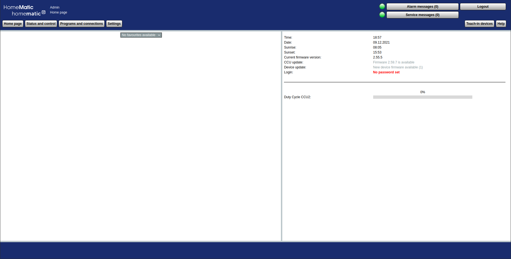

> :information_source: This is part two of the documentary and covers the attacks on BidCos. 
> The [first part](1-bidcos.md) which deals with the protocol description can be found here, as well as the [table of contents](1-bidcos.md).

# SDR and URH

## Short explanation of SDR

SDR (Software Defined Radio) describes the concept of processing radio signals by means of software.
SDR also refers to the hardware component that is used to transmit and receive the signals.
Signal processing by software has several advantages over the use of hardware:
Devices used to have mixers, filters, amplifiers, modulators, demodulators, etc. as physical components, but nowadays all this can be implemented with the help of software.
As a result, the devices are much more flexible in their application, since only parameters in the software need to be adjusted when changes are made.
This makes SDR devices very compact (some only as big as a USB stick) and also inexpensive (from about 10€).

## Short Introduction to Universal Radio Hacker (URH)

> :information_source: It is highly recommended to check out the URH [user guide](https://github.com/jopohl/urh/releases/download/v2.0.0/userguide.pdf) and [video tutorial series](https://www.youtube.com/watch?v=kuubkTDAxwA&list=PLlKjreY6G-1EKKBs9sucMdk8PwzcFuIPB).

URH (Universal Radio Hacker) is the bridge between the SDR and the user.
The program allows to record radio telegrams, analyze them, and then retransmit them.
Unlike GNU-Radio, for example, most of the signal processing in URH is automated, which benefits users with little experience in the field of radio communications, since they only need to focus on reconstructing protocols.
URH divides this process into 4 distinct phases, and the results from one phase can be carried over to the next one:  

First, the signal of the target device has to be recorded to start with phase one afterwards.
In the interpretation phase, the recorded signal is demodulated, i.e. the recorded modulated signal is split back into the information signal (which contains the binary data) and the carrier signal.
This takes place autonomously, but can also still be adjusted manually.
In the next phase, the signal is analyzed, first determining whether the data is possibly encoded due to security or signal optimization.
If this is the case, it can be decoded using pre-installed or custom decoders. Individual data fields can then be assigned to the signal.
In the generation phase, the individual fields of the signal can be modified either manually or by fuzzing.
Finally, the modified or crafted signal can be sent.
If several devices are involved or if it is necessary to react to a message from the device, the simulator can be used instead of the generator.
In this mode, flowcharts can be used to react to messages in real time.
[*URH User guide*](https://github.com/jopohl/urh/releases/download/v2.0.0/userguide.pdf)

# Theoretical Attack Vectors

Since all attacks only target the radio link, it is assumed that the attacker can manipulate this radio traffic with the help of an SDR.
Information about the execution can be found under [*Practical Attacks with URH > Attacks*](#attacks).

## Sniffing

Goal:

- Gathering information

Requires:

- Nothing

Since there is no encryption in the BidCos protocol, all messages can be intercepted and analyzed.
Sniffing is also the basic requirement for any further attacks, as you need to gather various information about the target HM network in advance:

- The individual source / destination addresses of the HM devices.
  - If all devices interact with only one device, this device will probably be the CCU.
  - Which device send configuration messages? -> CCU
  - Does a device receive a message and send one to another device shortly afterwards? -> CCU
- Which devices are peered and / or paired?
  - Check if a device communicates only with the CCU or also directly with other devices
- What device types are used?
  - Check the type / subtypes of a message.
  Also compare the payload with the message type table and the XML files.
- Is authentication used on the network?
  - Check if devices send messages of the type *AES_REQUEST* (0x03).
  - Does every device in the network use Authentication? Which not?
  - Is the standard key used or a custom one? -> Use the [debugger script](#debugger-script).

But not only Homematic-specific data can be relevant for the attacker.
He could also derive certain behavioral patterns of the user or homeowner from the metadata / states of the devices in order to e.g. to better plan a burglary.

## Replay attack

Goal:

- Duplicate messages

Requires:

- The channel of the target device must **not** use authentication

A replay attack is the simplest form of attack.
An attacker only has to record a transmission with the SDR and then simply replay the recorded IQ data.
Since this attack is so simple, you wouldn't even need URH, you could just use the HackRF command line tool.

> :information_source: If the sequence number / counter (if one used) differs too much or the same data is used too often, it may result in the message not being accepted by the receiver.
> To fix this, a new message must be recorded again.

> :information_source: Some message types have an independent counter in the payload in addition to the sequence number.

## Easy spoofing (URH Generator)

Goal:

- Transmission of manipulated messages

Requires:

- The channel of the target device must **not** use authentication
- Works only with simple communication, in which the transmitter does not have to respond to further messages.

This attack is an enhancement of the replay attack, because we take an extra step and modify the signal first before repeating it.
To do this, we must first remove the obfuscation of the recorded signal.
Then we can manipulate the payload:

In the following example, we modify the VALUE field of the payload.
For a window sensor, the value 0x00 means that the window is closed and 0xC8 that the window is open.
With this new state, we can craft a payload by calculating a new CRC and apply the obfuscation again.
Then we can transmit the manipulated message to the lamp.
Since no authentication takes place, the target device has no way to distinguish an attacker from a valid communication partner and accepts any manipulated message.
It is only important that the source address of our manipulated message matches that of a device which is peered or paired with the target device.

> :information_source:  Again, it must be noted that the values of the sequence number / counter should not repeat.
> This applies to all subsequent attacks.

## Advanced spoofing (URH Simulator)

Goal:

- Transmission of manipulated messages

Requires:

- The channel of the target device must **not** use authentication
- Works with complex communication, in which the transmitter has to respond to further messages.

If you want to send a communication frame consisting of more than just one message and an ACK, you have to use the simulation mode of URH.
As an example you can take the configuration of a device, this consists at least of a start message, a message with the appropriate parameters and an end message.
Each individual message is confirmed by the recipient with an ACK.
Therefore, the attacker must always wait for the ACK before sending a new message.

## Authentication spoofing

Goal:

- Transmission of manipulated messages

Requires:

- The channel of the target device **uses** authentication
- The AES-Key **is** known

For this attack, we again need the simulator mode of URH, in which we have to implement the [challenge response](#authentication). 
For this, we also need external scripts that perform AES operations for the generation of the response.

After that, we only need to implement the challenge response process in URH so that our message is accepted by the target device.

> :information_source: Even if the device we are spoofing is still active in the target Homematic network, it will not interfere with our spoofing attack.

## AES-Key extraction (disassociation + sniffing)

Goal:

- Obtain a custom AES-Key of a Homematic network

Requires:

- At least **one** device does not use authentication
- The AES-Key is **not** known
- User interaction

This attack aims to obtain the AES-key from a HM network with a custom security key.
This attack is divided into two parts:

**Step 1:**
In the first step, we search for a device on the network that does not use authentication.
This task can be done fairly quickly in most of the cases, since only some devices use authentication out of the box and even after Eq3's official recommendation, one should avoid using authentication for the entire network:

> "Wir empfehlen eine gesicherte Übertragung für sicherheitsrelevante Komponenten wie z.B. KeyMatic, WinMatic und Geräte, die für eine Alarmanlagenfunktion eingesetzt werden.
> Andere Homematic Komponenten sollten gemäß Ihrer Funktion / Sicherheitsrelevanz beurteilt werden.
> Ein Schaltaktor zum Einschalten einer Flurbeleuchtung mit Energiesparlampen benötigt in der Regel geringere Sicherheitsrichtlinien im Vergleich zu einem Schaltaktor, der zur Ansteuerung eines Garagentors oder einer Gartenbewässerungsanlage verwendet wird."
> [*EQ-3 Blogpost*](https://www.eq-3.de/service/faq/stimmt-es-dass-die-verschluesselung-des-homematic-systems-nicht-sicher-ist-bzw-das-system-gehackt-wurde-wie-kann-ich-mein-homema.html)

Once we have found this device, we can perform a factory reset by using the message type *RESET*.

**Step 2:**
Now we have to wait for the owner to notice that his device no longer responds to commands. 
Supporting this is also the web interface of the CCU, since there will appear a service message that the device no longer responds. 
At some point he will teach-in the device back to the CCU and then we sniff this process and extract the custom key from it as described in [AES Key-Exchange](#aes-key-exchange).
We can extract the key because a factory rest also deletes all custom AES-Keys on the device and the new key is only encrypted with the default key.

## PDoS (works partly)

Goal:

- Permanently disable the device

Requires:

- The device must belong to the *SEC* series or support *Lock reset via device button*
- The AES-Key **is** known
- The device must be at least paired

We take advantage of the fact that under some circumstances, resetting a device to its factory state is no longer possible via its configuration button.
There are two different options how to reach this state:

- Devices of the *SEC* series:
  - These devices block the reset button as soon as a custom security key has been set and at least one channel has authentication activated.
- Devices with an easily accessible configuration button:
  - These devices can lock the configuration button via an available setting (*Lock reset via device button*).
  This mode can be set manually in the web interface under *Settings > Devices > Set > Lock reset via device button*.

**Procedure:**
In all steps, we pretend to be the CCU so that the target device accepts our messages.

1. Find out if the target device is peered and if so, to which channels of which devices.
   This can be found out either by sniffing or by using an existing message type for this purpose (CONFIG_PEER_LIST_REQ).
2. Remove all peers of the device with the corresponding message type (CONFIG_PEER_REMOVE).
   This is important so that no peer connections are active later.
3. Activate the authentication for at least one channel of the device (CONFIG_WRITE_INDEX).
   In this way, we prevent the device from pairing with a CCU or peering with other devices without authentication.
   (SEC-Device channels normally use authentication by default, but the user may have disabled it)
4. Lock the config button to prevent a later reset of the device (CONFIG_WRITE_INDEX).
   (Not necessary for SEC-Devices)
5. Set a new security key (EXCHANGE_KEY).
   It is important that always a new random key is used, otherwise the devices could still be peered with each other.
6. Teach-out the device (CONFIG_WRITE_INDEX).

Now the device is completely inoperable as it can no longer be paired with a CCU, peered with other devices or be rest.
The only way the user can use their device again is by sending it to EQ-3 for a [fee](https://files.elv.com/downloads/forum/systemsicherheitsschluessel_20_10_2012.pdf#page=3), who will then flash the device with a new firmware.

Devices for which the attack is not executable:

- HM-CC-RT-DN
  - Although it is possible to lock the device keys, a hard reset can still be performed ([manual](https://www.eq-3.de/Downloads/eq3/downloads_produktkatalog/homematic/bda/HM-CC-RT-DN_UM_GE_eQ-3_web.pdf#HM-CC-RT-DN_UM_GE_eQ-3_161128.indd%3A.34636%3A1118))

## Battery drain DoS (not tested)

Goal:

- Temporarily disable the device

Requires:

- Battery powered device

An attacker could disable battery-powered devices by draining the battery through sending specific messages.
For example, he could send several burst messages to a thermostat over a longer period of time, and the thermostat would wake up after each burst received.
This would affect not only the thermostat, but all devices that receive messages with burst.
By cleverly manipulating the message, the device could also be tricked into sending multiple messages, which would increase the power consumption even more.
Also, battery-powered actuators could be forced to perform actions to further increase power consumption. This should only be done when the owner is not at home, which can be determined by analyzing sniffed messages.

# Attacking Homematic with URH

In the following chapters, we will first describe how to properly configure your Homematic equipment to create your own laboratory environment.
We will then explain how to implement the theoretical attack vectors from the previous chapter step by step in URH.

## Homematic setup

In the following, we will describe how to properly configure your Homematic devices to set up your own laboratory environment.

### CCU setup

1. Connect the CCU via a mini-USB cable with your Computer.

   > :information_source: Avoid using a USB hub.

2. Click on the flowing link to get to the web interface: http://10.101.82.51

   - The *sid* URL parameter is needed to get to the [developer menu](https://homematic-forum.de/forum/viewtopic.php?f=31&t=26624): http://10.101.82.51/tools/devconfig.cgi?sid=`<YOUR-SESSION-ID>`

You will now be shown the home page of the web interface:



### Pair a new Device

1. Click in the upper left corner on *Teach-in devices.*
2. Either the device is taught-in via its serial number or by pressing the configuration button on the device itself.
   - The serial number of HM devices can be found on small stickers, which are usually attached to places that are not directly visible, such as a battery compartment.
   A second sticker can also be found on the packaging of the device.
   - If you decide to teach-in using the configuration button, you must first activate the teach-in mode of the CCU.
   To do this, **first** click on *Teach-in devices* and then on the *Teach-In HM device* button in the dialog box.
   You now have 60 seconds to activate the teach-in mode of the device to be taught in.
   This mode is usually activated via a button, which has to be pressed or held for 4 seconds.
   For more detailed information for your device, please refer to the manual under the point "teach-in".
3. Now you should click on the button *Inbox(1)*.
   Inside this menu, we can make further settings for our new device, if we wish.
4. To successfully complete the teach-in, you only need to click on the *Done* button.

### Unpair / reset a device to factory settings

1. Click on *Settings* > *Devices*
2. Search for your target device and click on *Delete* on the right site.
3. Now you can either unpair the device or do a factory reset.
   - In case of an unpair, some settings such as direct connections or a custom AES-key are retained.
4. Now put the device into configuration mode by pressing the configuration button on the device, then you have about 10 seconds to click on the Delete button in the dialog box.
   For some devices, such as electric sockets, it is not necessary to activate this mode, as these devices can permanently receive messages (device must accept lazy config).
   Also, some devices can receive the unpair/reset message by triggering them to send a message. E.g.:
   A shutter contact detects a change of state exactly in the time window of the unpair/reset process and transmits this to the CCU.
   The CCU can then respond with a configuration message (lazy config).

> :information_source: Lazy config allows a device to receive configuration messages even if the config button on the device has not been pressed.
> These messages are either sent directly to the target device or the target device sends a message again on its own (depending on the [receiving strategy](#receiver)).

### Activate CR for a Channel

1. Click on *Settings* > *Devices*
2. Search for your target device and click on **+** on the left site.
   Now you should see all channels of the device.
3. Search for the channel for which CR should be activated and left-click anywhere in its row.
4. Now you can change the Transmission mode in the dialog box from *Standard* to *Secured* (CR activated).
5. Confirm the change with the click on the *OK* button.

### Control a device / check the current status

In this menu, you can check the current status of a device and directly control it.

Click on *Status and control* > *Devices*

### Peer devices (channels) with the CCU

1. Click on *Programs and connections* > *Direct device connections*.
2. Click on *New connection*.
3. Search for the channel of the device to be peered and click on *Select*.
4. Search for the other channel of the device to be peered and click on *Select*.
5. Click either on *Create* or *Create and edit* to adjust condition.
6. Make sure that the devices can receive configurations (push the configuration button on battery devices or trigger a message).

### Peer devices (channels) without the CCU

> :information_source: Once a device is paired with the CCU, direct connections (peers) to other devices can only be made via the CCU.

Basically, both devices must be brought into the configuration mode, this is usually done by pressing or holding the configuration button on the device.
For more details, please refer to the manuals of the devices to be connected.

### Add a new CCU Program

In a program, the CCU does all the logic work.
Devices only ever communicate with the CCU, which processes the information it receives and controls other devices if necessary.

1. Click on *Programs and connections* > *Programs & CCU connection*.
2. Click on *New* on the bottom side.
3. New conditions can be added via the green plus sign on the left side.
4. When you have set all the conditions, you finish with *Save settings as new program*.

### Reset the CCU to factory settings

1. :warning: First check if a security key has been set! 
   If so, make sure you know it, otherwise see "Restore the default security key".
2. Click on *Settings* > *Control panel* > *Security*.
3. Click on *System Reset* and enter the current security key if one is set.

The reset can also be performed via the recovery system.
You can find instructions [here](https://www.eq-3.de/Downloads/eq3/pdf_FAQ/Recovery-System.pdf).

### Set / Change the security key

> :no_entry: **Attention! You can really screw up your setup if you do something wrong! :no_entry:**

1. :warning: Make a note of the new key! 
   The new key should not contain the *&* character!

   > :no_entry: If you forget the key and the CCU is reset after setting this key, you can no longer teach-in the paired devices! 
   > Also, backups that were created while the security key was active can no longer be restored!

2. Make a backup of the current state of the CCU:

   1. Click on *Settings* > *Control panel* > *Security*.
   2. Click on *Create Backup* and wait a few minutes.
   3. Give the file a descriptive name!

3. Make sure that all paired devices are able to receive messages and that no configurations for devices are pending!

4. Click on *Settings* > *Control panel* > *Security* and set the new security key.

5. For some devices, the configuration button may still need to be pressed. 
   You can find out which devices have not yet received a new key from the service message box.

More information about the procedure and the security key can be found [here](https://www.homematic-inside.de/faq/sicherheitsschluessel).

### Restore the default security key

> :no_entry: **Attention! You can really screw up your setup if you do something wrong! :no_entry:**

To restore the default key in the entire Homematic network (CCU and all devices), please proceed as described below:

1. Make a backup of the current state of the CCU (see above).

2. :warning: Delete the changed security key on all devices that are or were connected to the CCU by performing a factory reset (teach-out is not enough!)  with all devices. 
   See [*Unpair / reset a device to factory settings*](#unpair-reset-a-device-to-factory-settings)

   > :information_source: If the devices are only taught-out from the CCU, they still use the changed security key and cannot be taught-in again directly later. 
   > Since the old key must then first be entered. 
   > If you now get confused with the devices and have not written down all the keys assigned in the past, this can lead to the fact that devices can never be taught-in again.

   > :information_source: Devices can also be reset using URH and the flow graph *auth-reset.sim.xml*.

3. Now also delete the security key on the CCU by performing a [factory reset](#reset-the-ccu-to-factory-settings).

More information about the procedure can be found [here](https://files.elv.com/downloads/forum/systemsicherheitsschluessel_20_10_2012.pdf).

### SSH

Check if SSH is activated and change / set a password:

1. Click on *Settings* > *Control panel* > *Security*.

Connect to the SSH server as the user root: `root@10.101.82.51`

### AES-Key information

1. Log into the CCU via SSH.

2. Run `crypttool -g` for more in depth information about the CCU AES-Keys:

   - Output with no custom key:

     ```
     Default key = 0
     Current user key = 0
     Previous user key = 0
     Temporary key = 0
     ```

   - Output after the first time a custom key was set:

     ```
     Default key = 0
     Current user key = 1
     Previous user key = 0
     Temporary key = 0
     ```

   - The numbers indicate the index of the keys.
   The default key always has the index 0, if you now set a security key for the first time, it will have the index 1.
   Since this key is now used, *current user key* points to the index 1.
   If you change the key again, *current user key* would point to index 2 and *previous user key* to index 1.
   The index is the same as the one used during the [key exchange](#aes-key-exchange).

3. All keys can also be found as a MD5 hash in the following file: `/usr/local/etc/config/keys`  

## Practical Attacks with URH

In the following it is described how to use URH correctly in the context of Homematic, this is shown on the basis of the individual phases.
Subsequently, it is described how you can implement the [theoretical attacks](#theoretical-attack-vectors) in URH.
For this you will also find a [video tutorial](https://www.youtube.com/watch?v=ou_yOsTa72E) which is in German.

### Setup

1. Connect your SDR with your computer.

1. Start URH and open either the project `urh/empty` or `urh/example`.

   - *Example* contains in contrast to *empty* already recorded Homematic messages, which you can compare with your own messages.
   - In the *flow-graphs* folder of the projects you will find ready-made flowcharts which you can use for the simulation mode.
   - The folder *scripts* contains python scripts which are embedded in the flowcharts.
   Also, there are two decoders for Homematic messages and the debugger script.

2. Switch to the analysis tab and make sure that in the drop-down menu *Decodings* the entry *Homematic* is present.
   If not:

   1. In the same dropdown menu, click on the three dots.
   2. Drag and drop the function *Cut before/after* into the *Your Decoding* field.*
   3. *Cut before* should be ticked and *10101010* should be displayed in the *Symbol* field.
   4. Drag and drop the function *Remove Data Whitening (CC1101)* into the *Your Decoding* field, it should be located under the *Cut before/after* function.
   5. Tick the checkbox *overwrite CRC16*.
   6. Drag and drop the function *External Program* into the *Your Decoding* field, it should be located under the *Remove Data Whitening (CC1101)* function.
   7. Select the for *Decoder* and *Encoder* the *Homematic* script.
   Make sure you also add the command line parameter *d* and *e* for the corresponding scripts.
   8. Finally, click on *Save as...* to save the custom encoding.

   **This step is necessary to correct any misinterpretations. More about this in the next step.*

### Recording / Interpretation

[Jump to the video tutorial.](https://youtu.be/ou_yOsTa72E?t=94)

The recording process is the same as for any other device.
You should pay attention to the fact that the frequency 868.3 MHz is selected and the messages of each device are all similar in strength.
This is particularly relevant when communicating with the CCU, as this sends a quite strong signal compared to a battery device.
It is best to use a large table, on which you can easily adjust the distance between the devices.

> :information_source: If you put the CCU upright and point the side with the connections towards the antenna of the SDR, you will receive a weaker signal.

In the interpretation step, you should make sure that FSK is selected as the modulation type.
After that, you can use the *Autodetect parameter* function.
*Sample / Symbol length* of 200 samples (depending on the sample rate) or better, 200µS should be detected automatically.
If there is no preamble / sync (aaaaaaaae9cae9ca / d555555574e574e5) recognizable in the hexadecimal display, you should change the error tolerance.
Personally, I have found that a value around 4 is quite suitable, but this can also vary.
If still no useful message is visible, we can further adjust the central line.
To do this, we switch to demodulation mode and increase the scale of the Y-axis.
Now we position the X-axis so that it is exactly centered between the two extremes.
You may have to jump back and forth between adjusting the X-axis and the error tolerance to get a usable result.

Sometimes it can happen that the signal in the analog view looks good, but in the demodulated view no clear separation between 0 and 1 is recognizable.
In this case, the only thing that helps is to record the messages again.

> :warning: **Messages sent from a CCU are sometimes not interpreted correctly by URH!** But this is not a big deal, because this error is corrected in the analysis step when decoding the message.
> So if instead of the normal preamble / sync (aaaaaae9cae9ca) d555555574e574e5 is displayed, it is still an integer message.
> The reason for this is that messages from a CCU do not start completely clean and URH therefore recognizes an extra bit.

### Analysis

[Jump to the video tutorial.](https://youtu.be/ou_yOsTa72E?t=231)

1. Switch the *View data as* option from *Bits* to *Hex*.
2. Decode the messages, by marking your target messages and select *Homematic* in the *Decoding* dropdown menu.
3. All messages should now already be divided into individual fields (default message type).
   If you want to further subdivide the payload of a single message, you can either assign one of the existing message types or create a new one.
   Which bytes of the payload can be assigned to which field can be seen in the table under *[BidCos > Structure > Type](#type)* or in the XML file of the device.
   For this, the exact message type must first be determined, which is composed of the type and subtype bytes.
4. If necessary, *participants* in URH can be assigned to messages originating from the same devices. 
   For many messages, you get a better overview this way.

### Generator

[Jump to the video tutorial.](https://youtu.be/ou_yOsTa72E?t=886)

If you only want to send a single message, you should use the generator mode.

1. Drag and drop the message you want to send into the *Generator Data* field.
2. Change the *Viewtype* in the lower right corner to hex.
3. Now you can edit the message before sending it.
   You could for example change the source/destination address or manipulate the individual fields of the payload.
4. Optionally, you can also fuzz the sequence number (use the default strategy settings).
5. Click on *Edit ...* to change the modulation settings.
   Drag and drop your signal in the field in the lower right corner.
   Check that *Gaussian Frequency Shift Keying (GFSK)* is selected as the modulation type and hit *Auto detect from original signal* (processing takes a moment).

   > :warning: Click on the settings icon at the option *Frequency in Hz* and check that for the symbol 0 the value 0 kHz is set!
   > For the symbol 1 a value around 30 kHz should have been detected.
   > The auto-detect function often mixes up these two values and then no valid signal is transmitted.

6. Close the window and click on *Send data...*.
   Check that your right SDR is selected and hit start.
   The gain value can be turned up as required.

### Simulator

[Jump to the video tutorial.](https://youtu.be/ou_yOsTa72E?t=2159)

The simulator is used to send more complex message frames.

1. Before starting the simulation, a test recording should be made.
   Proceed as described in the step *Recording / Interpretation* and avoid moving the devices afterwards.

2. Either drag and drop a pre-made flow graph from the *flow-graphs* folder into the *Flow Graph* field or build your own one.

3. Make sure that no item is highlighted in red.

4. Ensure that the *timeout* duration is equal or higher than 30000 ms and that the *maximum retries* are equal or higher than 50.

5. Click on *Simulate...* and switch to the *RX settings* tab.
   Select the SDR which should receive the messages.
   In the dropdown menu *Use values form* select the test recording and click on the button *Use*.
   You may want to uncheck the *Center: automatic* and or *Noise: Adaptive* checkbox.

6. Switch to the *TX settings* tab and select the SDR which should transmit messages.
   I would recommend increasing the Gain and IF Gain settings when using the HackRF.
   If no modulation settings have been previously made, proceed as described in the *Generator* step 5.

   > :information_source: The simulator in URH is not capable of running full duplex!
   >
   > So it is not possible to use only one full-duplex SDR like the LimeSDR for TX and RX at the same time.
   > It is mandatory to use two independent SDRs!
   
7. Switch to the *Simulation* tab, tick *Capture complete RX* and hit *Start*.

> :information_source: On older URH versions, there were problems with the HackRF in simulation mode.
> To fix this, go to *Edit* > *Options...* > *Generation* and set the *Modulation accuracy* to *Low*.

### Attacks

> :warning: The used flow graphs include different python scripts, which depend on the package *pycryptodome*. 
> So make sure that this is installed (`pip install pycryptodome`)!

> :warning: The scripts do not contain the [default key](https://pastebin.com/eiDnuS8N). It must be added by before use!

#### Sniffing

Recommended Homematic setup:

- Any type of setup

Just proceed as described above in the [*Recording / Interpretation*](#recording-interpretation) and [*Analysis*](#analysis) steps.

#### Replay-attack

[Jump to the video tutorial.](https://youtu.be/ou_yOsTa72E?t=2)

Recommended Homematic setup:

- Two devices which are peered and do not use authentication  

1. Proceed as described in the [*Recording / Interpretation*](#recording-interpretation) step or drag an existing recording into the interpretation field.
2. Above the name of the signal in the interpretation tab there are three buttons: rectangle (play), i (info) and x (close).
   Click on the [play button](https://youtu.be/ou_yOsTa72E?t=184) to open the *Send signal* window.
3. Select your SDR. If you want, you can also edit the signal live like in the interpretation mode.
4. Click on *Send* to replay the signal.

#### Easy spoofing

[Jump to the video tutorial.](https://youtu.be/ou_yOsTa72E?t=2)

Proceed as described in the [*Generator*](#generator) step.
You can either use your own signal or an existing one.

#### Authentication spoofing

[Jump to the video tutorial.](https://youtu.be/ou_yOsTa72E?t=1251)

1. Proceed as described in the *[Simulator](#simulator)* step.
   Use the already existing flowchart *authentication.sim.xml*.
2. Make sure that the participants are correctly assigned.

3. Either edit the first message or drag your own message into the flow graph field.
   If you use your own message, the first current item must be deleted and your own message must be dragged to the first position.
   Don't forget to change the source to A (Attacker) and the destination to *Broadcast*.
4. If item 3.1.1 is highlighted in red, please check if the path to the script *response_generator.py* is correct.
5. Please make sure that the command line parameter *-t* of the response_generator.py script matches the message type of the first element.
6. If the target device uses a modified security key, it must be specified via the command line parameter *-k* (as MD5 hash).
   If the default key is used, you do not need to specify this parameter.
7. Now the simulation can be started.

#### AES-Key extraction

[Jump to the video tutorial.](https://youtu.be/ou_yOsTa72E?t=3048)

1. Start by sniffing the target network for a device that does not use authentication and also find out the address of the CCU.
2. Proceed as described in the *[Simulator](#simulator)* step.
   Use the already existing flowchart *key-extraction.sim.xml*.
3. Swap the source address of the first item with that of the CCU and the destination address with that of the target device.
4. If item 3.1.1 is highlighted in red, please check if the path to the script *key_extractor.py* is correct.
5. Now the simulation can be started.

#### AES-Key extraction + Authentication spoofing

With the flow graph *key-and-cr.sim.xml* the individual graphs *key_extractor.py* and *authentication.sim.xml* are combined.
Note that the script *key_and_response.py* only needs the parameter *-t*.

#### PDoS

> :information_source: So far, all flowcharts are working, except for the key exchange.
> The KEY_EXCHANGE messages are generated correctly, but the response is not accepted by the devices.
> This could possibly be because the response message is sent outside the actual transmission window (250ms).
> This is partly due to python and partly due to URH, because besides the C-Frame, also the M-Frame is decoded again.

1. Obtain information about the target device (its address, address of the CCU, possibly the addresses of its peers, whether a channel uses authentication).
2. Use the *peer-list.sim.xml* flow graph to find out if the device is peered and if so with whom.
3. If one or more peers are present, they can be removed with the *delete-peer.sim.xml* flow graph.
   1. Channel field: Channel of the target device which is peered.
   2. Peer Address: Address of the peered device.
   3. Peer Channel A: Channel of the peered device.
4. If a channel of the target device does not use authentication yet, enable it with the *switch-channel-security.sim.auth* flow graph.
   1. The Data field of the CONFIG_WRITE_INDEX message should be set to 0x01 (On).
5. Use the *lock-config-button.sim.xml* flow graph to lock the configuration button of the target device (Not necessary for SEC-Devices).
6. Use the *key-change.xml* flow graph to change or set a security key.:warning: **NOT WORKING YET** :warning:
7. Use the *teach-out.xml* flow graph to teach-out the target device from the CCU.

# Future Research/Work and Tools

## Useful links

If you want to research further yourself, these are good starting points:

- Forums
  - [FHEM](https://forum.fhem.de/index.php/board,22.0.html)
    - deeper technical topics / general topics
  - [HomeGear](https://forum.homegear.eu/)
    - deeper technical topics / general topics
  - [HomeMatic](https://homematic-forum.de/forum/)
    - general topics / functionality of Homematic
- Wikis
  - [FHEM](https://wiki.fhem.de/wiki/HomeMatic)
- Websites
  - [HomeMatic inside](https://www.homematic-inside.de/)
    - informatitve FAQ and blogposts
- Source code
  - [FHEM](https://github.com/mhop/fhem-mirror/blob/master/fhem/FHEM/10_CUL_HM.pm) & [FHEM](https://github.com/mhop/fhem-mirror/blob/master/fhem/FHEM/HMConfig.pm) (Perl)
    - BidCos implementation
  - [AskSin++](https://github.com/pa-pa/AskSinPP) (C++)
  - [HM-CFG-USB](https://github.com/jp112sdl/hmcfgusb) (C)
- Scientific work
  - https://www2.htw-dresden.de/~wiki_sn/images/6/6f/Master_Bericht_WS2012-13_Homematic.pdf
  - https://www2.htw-dresden.de/~jvogt/abschlussarbeiten/Kupke-Masterarbeit.pdf
  - https://pub.fh-campuswien.ac.at/obvfcwhsacc/content/titleinfo/5430122/full.pdf
  - https://opus.hs-offenburg.de/frontdoor/deliver/index/docId/2304/file/THESIS+FINAL+LUKAS+M%c3%9cLLER+OPEN+SOURCE+SMART+HOME.pdf
  - https://ntnuopen.ntnu.no/ntnu-xmlui/bitstream/handle/11250/2405119/15721_FULLTEXT.pdf?sequence=1
  - https://www.informatik.uni-bremen.de/~sohr/papers/mueller.pdf

- Other
  - https://wiki.fhem.de/wiki/Homematic-Ger%C3%A4te%C3%BCbersicht
  - https://github.com/eq-3/occu/tree/8cb51174c2bc8c4b33df50a96b82c90e8092f79c/firmware/rftypes
  - https://psytester.github.io/eQ-3_Sicherheitsbewusstsein_zur_Homematic_CCU/
  - https://wiki.fhem.de/wiki/HomeMatic_Namen_verstehen
  - https://www2.htw-dresden.de/~wiki_sn/index.php/HomeMatic#Protokoll


## Tools

### HMSniff

HMSniff is a great tool for sniffing BidCos messages, but it requires the HM-USB-CFG to work, which is also a benefit since the USB stick handles all the signal processing and just dumps the content of the messages.

> :information_source: Messages from the type AES_RESPONSE (0x03) will not be displayed.

You simply have to clone the [repository](https://github.com/jp112sdl/hmcfgusb), plug in the USB-CFG and run the *hmsniff* script as root.

### Debugger script

The *debugger.py* (`urh/empty/scripts`) script helps you with debugging the authentication process.
You can either decrypt a response or generate a new one, by doing so the script will print detailed information about the process.
Parameter values should be separated by white spaces and contain only hex characters.
Messages can either be fully provided or without the preamble / sync word.

> :warning: Before using the script, the package *pycryptodome* must be installed (`pip install pycryptodome`)!  

> :warning: The script does not contain the [default key](https://pastebin.com/eiDnuS8N). It must be added by before use!

#### Key

Use the parameter *-k* / *--key* to force a specific AES-Key for the decryption / generation, otherwise the default key is used

#### Decrypt

Use the parameter *-d* / *--decrypt* to indicate that you want to decrypt the response.
The following parameters must be provided: M-Frame, C-Frame and the R-Frame.
You can also provide the A-Frame to compare it with the auth field.

#### Generate

Use the parameter *-g* / *--generate* to indicate that you want to generate a new response.
The following parameters must be provided: M-Frame and C-Frame.
You can also provide a time token to generate a specific response, if this parameter is not provided a random time token will be generated.
Additionally, the R-Frame can also be provided to compare the generated response with the actual one.

```
./debugger.py -d aaaaaaaae9cae9ca0c3da64128d89e318ec00130000000 aaaaaaaae9cae9ca113da002318ec028d89e04945080b1b3bd87090000 aaaaaaaae9cae9ca193da20328d89e318ec0816a4a90543d45571181cf2f6a69bc1e0000 aaaaaaaae9cae9ca0e3d8002318ec028d89e0005062c290000

Output:
DECRYPT RESPONSE
-------------------------------------------
M-Frame:         0C3DA64128D89E318EC00130000000
C-Frame:         113DA002318EC028D89E04945080B1B3BD87090000
R-Frame:         193DA20328D89E318EC0816A4A90543D45571181CF2F6A69BC1E0000

Challenge:       945080B1B3BD00000000000000000000
Key:             XXXXXXXXXXXXXXXXXXXXXXXXXXXXXXXX
Tmp key:         30B3F5770322D185F27C4E96FC273AE4
Payload:         816A4A90543D45571181CF2F6A69BC1E
IV:              30000000000000000000000000000000
Pd:              05062C299A8388AAFAE0D99398A4E6F7
Pd^:             2BE75AAC5C033DA64128D89E318EC001
-------------------------------------------
M-Frame:         0C 3D A6 41 28D89E 318EC0 01 30000000
DecrPayload:        3D A6 41 28D89E 318EC0 01
Correct:         True
Auth:            05062C29
Time token:      2BE75AAC5C03
-------------------------------------------
A-Frame:         0E3D8002318EC028D89E00 05062C29
Auth:                                   05062C29
Correct:         True
-------------------------------------------
```

## Future work

- Develop a script that successfully executes the key-exchange using the HM-CFG-USB.
- Find out the exact algorithm of how the next receiving window is calculated from the sequence number in [cyclic mode](#receiver).
- Understand and document the function and structure of the [Homematic registers](https://wiki.fhem.de/wiki/HomeMatic_Register_programmieren).
- Migrate the URH projects to low-cost and low-power embedded devices.
- Conduct experiments on the Battery drain DoS attack.